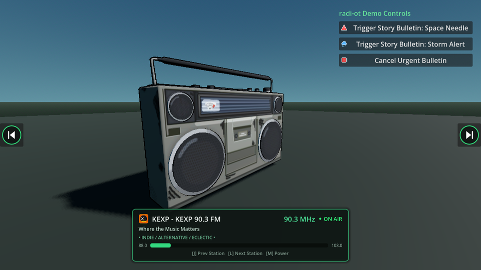

# radi-ot (Radio + Godot)

**radi-ot** is a feature-packed 3D audio streaming addon for **Godot 4.8** that streams real live Seattle radio stations over the internet. Built for both **Steam (Forward+)** and **Web (Compatibility)**, it features positional 3D audio, an in-game retro-modern CanvasLayer HUD, procedural FM tuning static, and an `urgent_bulletin()` API designed for in-game narrative progression and emergency broadcasts.

---

## Features

- **3D Positional Spatial Audio:** `RadiOtPlayer3D` extends `AudioStreamPlayer3D`, offering realistic distance attenuation, unit size, and panning attached to any in-game object (vehicles, radios, boomboxes, storefronts).
- **Curated Seattle Radio Presets (.tres):**
  - **88.5 FM — KNKX:** Jazz, Blues, and NPR News
  - **89.5 FM — C89.5 (KNHC):** Student-run Electronic, Dance, and House
  - **90.3 FM — KEXP:** World-renowned Independent, Alternative, and Eclectic
  - **91.3 FM — KBCS:** Community radio and diverse global sounds
  - **94.9 FM — KUOW:** Puget Sound NPR News and Information
  - **98.1 FM — KING-FM:** Classical Seattle
- **Urgent Bulletin System (`urgent_bulletin`):** Seamlessly interrupt live radio broadcasts with custom story audio (emergency broadcasts, story alerts, news flashes). When the bulletin finishes, live radio automatically resumes.
- **Retro-Modern CanvasLayer HUD:** Displays current frequency, call sign, genre, live signal indicator, animated dial bar, keyboard hints, and emergency alert banners.
- **Procedural FM Static:** Realistic white/pink noise static plays seamlessly while buffering or switching between stations.
- **Dual-Platform Streaming Engine:**
  - **Steam / Desktop (Forward+):** High-performance chunk-buffered HTTP client with automatic redirect handling (HTTP 301/302/307), MP3 frame-sync alignment, and persistent stream connection management.
  - **Web (HTML5 / Compatibility):** Native Web Audio API / HTML5 Audio integration with 3D camera-listener distance attenuation and volume tracking.
- **Interactive Demo Keyboard Controls:**
  - `[L]` — Tune to Next Station
  - `[J]` — Tune to Previous Station
  - `[M]` — Toggle Radio Power On/Off

---

## Installation

### Option 1: Manual Installation (Recommended)
1. Download or clone this repository.
2. Copy the `addons/radi_ot/` directory into your Godot project's `addons/` folder:
   ```text
   your_godot_project/
   ├── addons/
   │   └── radi_ot/
   │       ├── plugin.cfg
   │       ├── radi_ot.gd
   │       ├── resources/
   │       ├── scenes/
   │       └── scripts/
   ├── project.godot
   └── ...
   ```
3. Open your project in **Godot 4.8+**.
4. Go to **Project > Project Settings > Plugins** and toggle the **Enable** checkbox next to **radi-ot**.

### Option 2: Git Submodule
If your project uses Git, add `radi-ot` directly as a submodule into your `addons/` folder:
```bash
git submodule add https://github.com/kirbycope/radi-ot.git addons/radi_ot
```

### Option 3: Godot Asset Library
1. Open Godot and select the **AssetLib** tab at the top of the editor.
2. Search for **radi-ot**.
3. Click **Download**, then **Install** into your project.
4. Enable the plugin under **Project > Project Settings > Plugins**.

---

## Quick Start

### 1. Add to Your Scene

Instantiate the player scene in your 3D world (the script requires its children, so a bare `RadiOtPlayer3D` node is not supported):

```text
res://addons/radi_ot/scenes/radi_ot_player_3d.tscn
```

Its children are the `RadiOtStreamer`, the static and bulletin `AudioStreamPlayer3D`s, the `BulletinTimer` and the `RadiOtHUD`; all signals between them are wired in the scene. Set `hint_text` on the HUD from the scene that binds the keys:

```gdscript
radio.get_hud().hint_text = "[J] Prev Station   [L] Next Station   [M] Power"
```

### 2. Configure & Tune

- Select the `RadiOtPlayer3D` node in the Scene tree.
- In the Inspector, verify that `station_collection` is set to `seattle_stations_default.tres` (or assign your own custom collection).
- Run the scene (`F5` or `F6`).
- Call `tune_next_station()` to go to the Next Station
  - The demo uses the [L] key to tune next station.
- Call `tune_previous_station()` to go to the Previous Station
  - The demo uses the [J] key to tune previous station.
- Call `toggle_power()` to turn the radio on or off
  - The demo uses the [M] key to toggle power.

---

## How to Use

### Nodes to add and where

| Node | Where it goes | Set in the Inspector |
|---|---|---|
| `RadiOtPlayer3D` (instance `scenes/radi_ot_player_3d.tscn`) | Under the mesh of the radio prop, so it moves with the prop and sounds from it | `station_collection` (defaults to `seattle_stations_default.tres`), `auto_play_on_ready` to tune in as soon as the scene runs, `play_static_while_buffering`; the inherited `AudioStreamPlayer3D` `max_distance` / `unit_size` for how far the radio carries |
| `RadiOtHUD` (already inside the player scene) | Nothing to add; it is the `CanvasLayer` child of the player | `toast_hide` (auto-hide the panel after `toast_hide_seconds`), `hint_text`; or `enable_hud = false` on the player to drop it |
| `RadioStation` and `RadioStationCollection` resources | `.tres` files anywhere in your project | Station fields, then assign the collection to `station_collection` |

Minimum scene:

```text
World (Node3D)
└── RadioMesh (MeshInstance3D)
    └── RadiOtPlayer3D (radi_ot_player_3d.tscn)        <- the only node you add
        ├── RadiOtStreamer                              (inside the scene)
        ├── StaticPlayer3D, BulletinPlayer3D, BulletinTimer
        └── RadiOtHUD
```

Nothing else is required: the scene wires its own children. Drive it from buttons connected in the editor or from your own input code with `tune_next_station()`, `tune_previous_station()`, `toggle_power()` and `urgent_bulletin()`.

### How `demo.tscn` does it

| Demo node | What it demonstrates |
|---|---|
| `RadioMesh/RadiOtPlayer3D` | The player scene instanced under the radio mesh with `auto_play_on_ready = true`, so it tunes to the first station on start. On the web the `ClickToStart` layer waits for a click first, because browsers block audio until then. |
| `RadioMesh/RadiOtPlayer3D/RadiOtHUD` | `toast_hide = false` keeps the panel on screen; `demo.gd` sets `hint_text` in `_ready()`. |
| `RadiOtDemo` (root, `demo.gd`) | Holds the `radio_player` export (a NodePath to the player) and the J / L / M keys in `_unhandled_input`. |
| `UI/PreviousStation`, `UI/NextStation` (and their `TouchScreenButton`s) | `pressed` is connected in the scene to `_on_previous_station_pressed` / `_on_next_station_pressed`, which call the tune methods. |
| `UI/VBoxContainer/BulletinBtn1`, `BulletinBtn2`, `CancelBulletinBtn` | `pressed` is connected in the scene to handlers that call `urgent_bulletin(stream, text)` and `cancel_bulletin()`. |
| `Camera3D` | Orbited by `demo.gd` so you hear the positional attenuation and panning. |
| `Retro Radio` | A cosmetic GLB model; the sound comes from `RadiOtPlayer3D`. |

---

## Narrative Story Bulletins (`urgent_bulletin`)

Trigger emergency announcements, breaking news alerts, or story events that temporarily override the live stream:

```gdscript
extends Node3D

@onready var radio: RadiOtPlayer3D = $RadiOtPlayer3D

func trigger_emergency_story_event() -> void:
    var news_audio: AudioStream = preload("res://assets/audio/alien_invasion_news.ogg")
    
    radio.urgent_bulletin(
        news_audio,
        "EMERGENCY BROADCAST: Unidentified objects spotted over Elliott Bay and the Space Needle!",
        15.0 # Optional duration override in seconds
    )
```

You can also cancel an active bulletin early:
```gdscript
radio.cancel_bulletin()
```

---

## Custom Stations & Collections (`.tres`)

### Creating a New Station
Create a new `RadioStation` resource (`.tres`) in the Godot inspector:

```text
station_name: "Space Needle Beats"
call_sign: "KSEA"
frequency: 101.5
stream_url: "http://stream.example.com/live.mp3"
genre: "Synthwave / Cyberpunk"
tagline: "Soundtrack of the Emerald City"
description: "Late-night synthwave broadcast from atop the Space Needle."
```

### Station Collections
Group your stations into a `RadioStationCollection` resource (`.tres`) and assign it to the `station_collection` property of `RadiOtPlayer3D`.

---

## Public API Reference

### `RadiOtPlayer3D`
- `tune_next_station()` — Cycles to the next station in the collection.
- `tune_previous_station()` — Cycles to the previous station in the collection.
- `tune_to_station_index(index: int)` — Tunes directly to a specific station index.
- `tune_to_frequency(freq: float)` — Finds and tunes to the station closest to the given frequency (e.g. `90.3`).
- `tune_to_call_sign(call_sign: String)` — Tunes to a station matching the call sign (e.g. `"KEXP"`).
- `toggle_power()` / `set_power(is_enabled: bool)` — Powers the radio on or off.
- `urgent_bulletin(stream: AudioStream, text: String, duration: float = 0.0)` — Broadcasts a narrative alert.
- `cancel_bulletin()` — Cancels the current bulletin and resumes the live station.
- `get_current_station() -> RadioStation` — Returns the currently tuned `RadioStation` resource.

### Signals
- `station_changed(station: RadioStation)`
- `stream_buffering_started`
- `stream_playback_started`
- `stream_playback_failed(error_message: String)`
- `bulletin_started(bulletin_text: String)`
- `bulletin_finished`
- `radio_toggled(is_playing: bool)`

---

## Testing

Run the automated [GUT (Godot Unit Test)](https://github.com/bitwes/Gut) suite via the command line or the in-editor GUT panel:

### Command Line (Headless)
```bash
godot --headless -s addons/gut/gut_cmdln.gd -gdir=res://addons/radi_ot/tests/
```

Or run all project GUT tests:
```bash
godot --headless -s addons/gut/gut_cmdln.gd
```

### Godot Editor
1. Open the project in the Godot Editor.
2. Open the **GUT** bottom panel.
3. Click **Run All** (or select test scripts in `res://addons/radi_ot/tests/`).

---

## License & Credits

- Code is licensed under the [MIT License](LICENSE).
- Third-party assets and model attributions are documented in [credits.md](credits.md).

